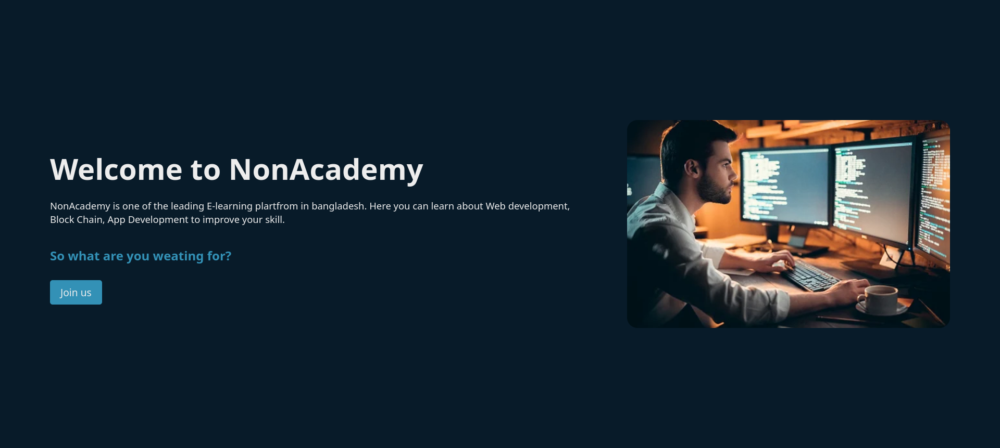
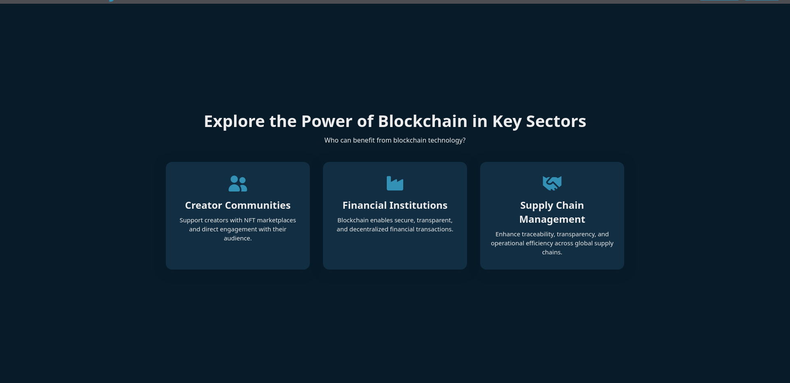

# NonAcademy-Assignment1

This Assignment is a modern, responsive landing page for **NonAcademy**, an E-learning platform.  
It demonstrates advanced HTML and CSS layout techniques, including Flexbox, CSS Grid, and mobile responsiveness.

## Features

- **Fixed Navbar:** Responsive navigation bar and sign up/login buttons.
- **Hero Banner:** Eye-catching introduction with call-to-action.
- **Clients Section:** Showcases client logos in a responsive grid.
- **Blockchain Power Section:** Highlights blockchain sectors with icon cards.
- **About Blockchain:** Two-column layout with stats and icons, matching modern UI patterns.
- **Blockchain Future:** Centered section with cards for trends and use cases.
- **Contact Us:** Side-by-side image and contact form, fully responsive.
- **Footer:** Four-column footer with company info, links, social icons, and newsletter form.

## Technologies Used

- HTML5
- CSS3 (Flexbox, Grid, Media Queries)
- [Font Awesome](https://fontawesome.com/) for icons
- Google Fonts (Poppins)

## Getting Started

1. **Clone the repository:**
   ```bash
   git clone https://github.com/yourusername/NonAcademy-Assignment1.git
   cd NonAcademy-Assignment1
   ```

2. **Open `index.html` in your browser.**

3. **Assets:**  
   - Place your client and blockchain images in the `Img/` folder as referenced in the HTML.

## Folder Structure

```
NonAcademy-Assignment1/
├── Img/
│   ├── logo1.png
│   ├── logo2.png
│   ├── blockchain1.jpg
│   └── ...etc
├── index.html
├── style.css
└── README.md
```

## Customization

- **Colors and Fonts:** Easily changeable in the `:root` section of `style.css`.
- **Content:** Replace text, images, and links as needed for your own project or brand.

## Screenshots



## License

This Assignment is for educational purposes. It is a assignment of NonAcademy Web development Course.

---

** Made for NonAcademy ❤️ **